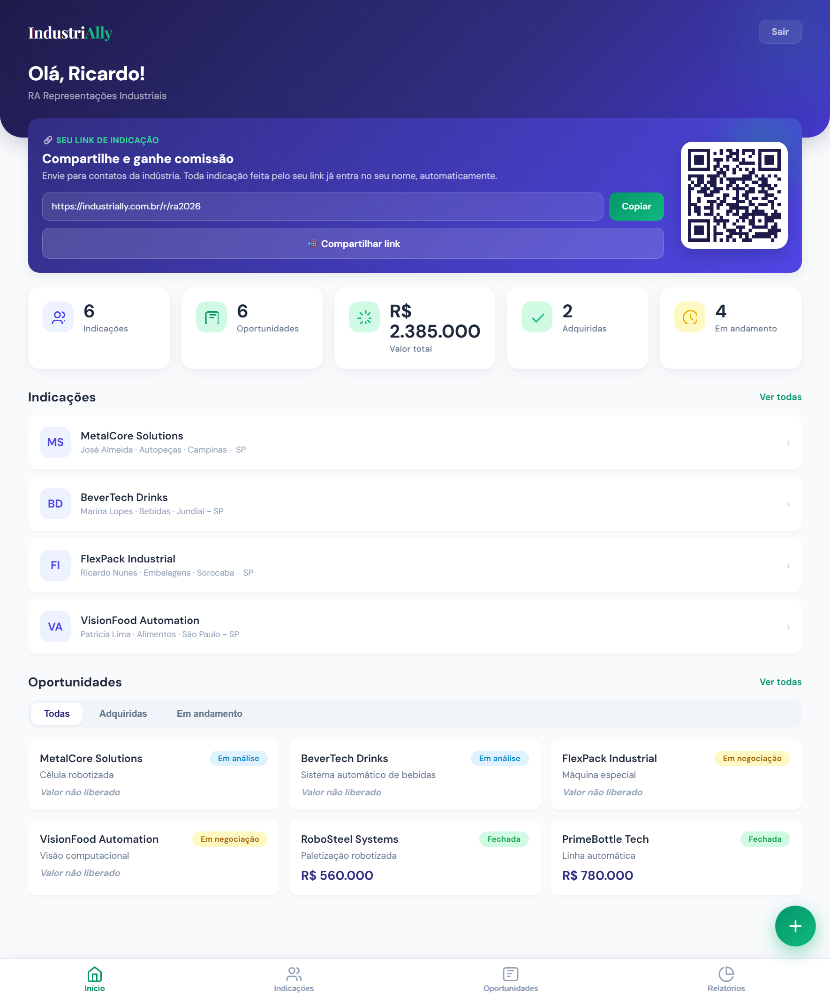
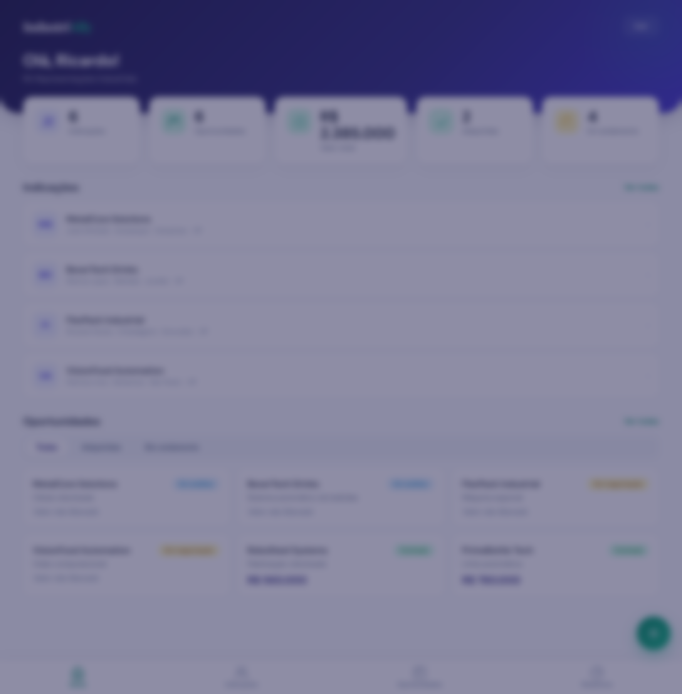
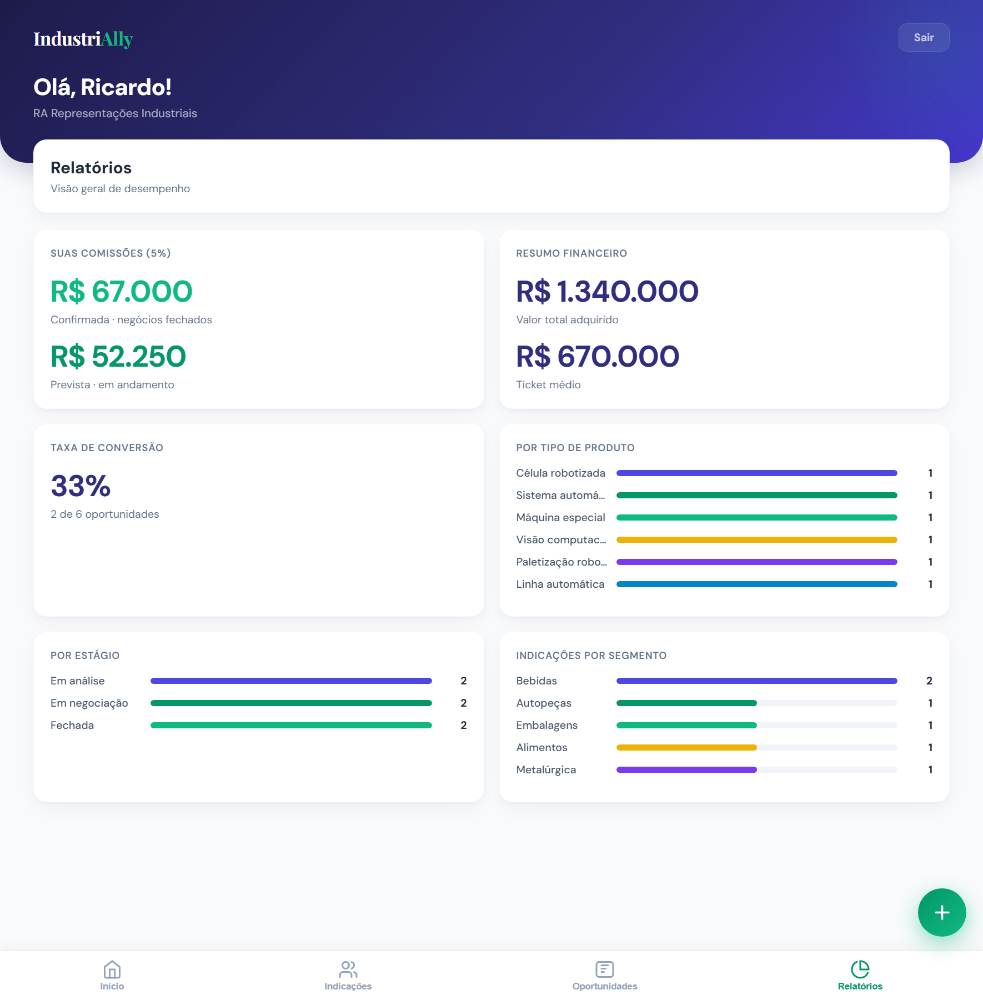

# IndustriAlly · Plataforma de Indicações + CRM


> Plataforma única, sob um só domínio e login, que junta duas frentes de venda de **automação industrial**: o **CRM interno** da equipe comercial e o **portal de parceiros** (**IndustriAlly**), onde indicadores externos trazem contatos da indústria e acompanham a comissão. Os dois **compartilham a mesma base** — a indicação do parceiro *nasce* como lead dentro do CRM. Roda em **Node puro**, sem framework e **sem nenhuma dependência**.

<p align="center">
  
  
  
</p>

---

## 1. Visão Geral e a Dor

A Celiware vende projetos de automação industrial por dois caminhos: a **equipe comercial interna** e uma rede de **parceiros/indicadores** que visitam indústrias e apontam oportunidades. Antes, esses dois mundos viviam separados — o CRM da equipe de um lado e um portal de parceiros *mockado* (dados fixos, sem cadastro real, sem integração) do outro. A indicação de um parceiro **não chegava ao CRM**, o parceiro não sabia o andamento e a comissão era controlada na mão.

**O que está sendo resolvido?**
Unir venda interna e indicação de parceiro em **uma plataforma só**: o parceiro cadastra a indicação → ela vira lead no CRM na hora → a equipe trabalha no Kanban → o parceiro acompanha o status simplificado e vê a comissão, tudo automático.

**Quem sofre com o problema?**
A equipe comercial (que perdia indicações no meio do caminho) e os parceiros (sem transparência do que acontecia com o que indicaram).

**Por que importa pro negócio?**
Cada indicação perdida ou sem acompanhamento é um projeto de cinco/seis dígitos que não fecha. Transformar parceiros em um canal rastreável — inclusive com **link/QR de indicação** — amplia a captação sem aumentar a equipe.

---

## 2. Arquitetura e Decisões Técnicas

| Camada | Escolha | Por que escolhi isso? | Alternativa considerada | Nota de impacto |
|---|---|---|---|---|
| **Runtime** | Node.js puro (módulo `http`) | O CRM já rodava assim; manter a stack evita reescrita e mantém o deploy leve | Express/Fastify | Zero dependências, fácil de hospedar |
| **Dados** | Arquivos **JSON** (lidos/escritos por request) | Decisão do cliente: manter o mesmo modelo do CRM; volume pequeno de leads | SQLite, Postgres, Cloudflare D1 | Simplicidade; migração futura é isolada na camada de I/O |
| **Núcleo único** | `clientes.json` é a **fonte de verdade** | A indicação do parceiro nasce como lead aqui; o portal é só uma *janela filtrada* do mesmo dado | 2 bancos que sincronizam | Elimina o problema de sincronização |
| **Front** | 3 páginas HTML/JS **sem build e sem framework** | Landing, CRM e portal servidos como texto pelo próprio Node; carregam rápido, sem toolchain | React/Vue + Vite | Simplicidade, 0 dependências |
| **Auth** | Token opaco em sessão de memória; senha do parceiro com **scrypt** | Suficiente para o porte; hash nativo do `crypto`, sem libs | JWT, OAuth | Menos superfície; sessão cai no restart (aceitável no porte atual) |
| **Multi-tenant** | Isolamento no servidor por `parceiroLogin` | O parceiro nunca decide o que vê; o filtro é sempre server-side | Filtro no front | Isolamento real entre parceiros |
| **Comissão** | **Derivada** do estágio do lead + `%` configurável | Fecha o negócio no CRM → comissão vira "Confirmada" sozinha | Campo manual | Nada de status esquecido |

**Rotas de front (um só servidor):**

```
/                → Landing IndustriAlly (marketing do programa)
/crm             → CRM interno (equipe): clientes, Kanban, dashboard
/partner /vendas → Portal do parceiro (indicações, oportunidades, comissões)
/r/<refCode>     → Página pública de indicação (link/QR do parceiro)
```

**O cruzamento (o coração):**

```
Parceiro cadastra indicação ─┐
Contato usa o link /r/<code> ─┴─►  nasce um LEAD em clientes.json
                                    (origem=parceiro, parceiroLogin, indicadoPor)
                                        │
CRM (equipe)  ──►  trabalha no Kanban (Novo → Contato → Proposta → Fechado)
                                        │
Portal do parceiro  ◄──  status simplificado (Em análise/Em negociação/Fechada)
                          + comissão (Prevista → Confirmada quando fecha)
```

---

## 3. Destaque de Engenharia / "The Hard Part"

**Fazer dois sistemas "conversarem" sem sincronizar nada.** O caminho óbvio — um banco para o CRM e outro para o portal, sincronizados — traz o pesadelo clássico de conflito de estado. Aqui não há sincronização: **existe um único registro**. A indicação do parceiro é gravada direto no `clientes.json` (o mesmo que o CRM usa), marcada com `origem: "parceiro"` e `parceiroLogin`. O portal do parceiro é apenas uma **projeção filtrada e traduzida** desse mesmo dado:

```js
// o que o parceiro vê é derivado do estágio interno do CRM — nunca um campo manual
function statusParceiro(lead) {
  const s = String(lead.status || '').toLowerCase();
  if (['fechado', 'conquistado'].includes(s)) return 'Fechada';
  if (['diagnostico', 'proposta', 'follow_up', 'nova_oportunidade'].includes(s)) return 'Em negociação';
  return 'Em análise';
}
```

Quando a equipe arrasta o card para **Fechado** no Kanban, o parceiro — sem nenhum job de sincronização — passa a ver **"Fechada"** e a comissão vira **"Confirmada"** (também derivada: `valor × %`). O isolamento entre parceiros é garantido no servidor: toda resposta do portal é filtrada por `parceiroLogin` do token, o front nunca escolhe o que aparece.

O **"a mais": link/QR de indicação.** Cada parceiro tem um `refCode` e uma página pública `/r/<refCode>` com a marca IndustriAlly. Ele compartilha o link (ou o QR) com um contato da indústria; o contato preenche um formulário curto e a indicação **já entra no CRM atrelada ao parceiro** — transformando cada parceiro em um canal de captação, sem login.

---

## 4. Estrutura

```
server.js          Servidor Node: roteamento, estáticos, API do CRM (/api/*)
partner.js         API do parceiro (/api/partner/*) e pública (/api/refer/*)
index.html         Landing do programa de parceiros
crm.html + js/app.js + css/styles.css   CRM interno (Kanban, clientes, dashboard)
partner.html       Portal do parceiro (mobile-first, SPA de um arquivo)
refer.html         Página pública de indicação (link/QR)
config.json        % de comissão padrão
seed.js            Gera dados FICTÍCIOS de demonstração (npm run seed)
img/               Logo + screenshots
```

Arquivos de dados (`clientes.json`, `parceiros.json`) ficam **fora do git** (ver `.gitignore`) e são criados pelo seed.

---

## 5. Como rodar (local)

Requer **Node.js 18+**. Não há `npm install` obrigatório (zero dependências).

```bash
npm run seed     # cria dados fictícios de demonstração
npm start        # sobe em http://localhost:3000  (ou defina PORT)
```

**Credenciais de demonstração:**

| Onde | Login | Senha |
|---|---|---|
| Portal do parceiro (`/partner`) | `parceiro@celiware.com` | `parceiro123` |
| CRM interno (`/crm`) | `valdir` | `demo1234` |

Link de indicação de exemplo: **`/r/ra2026`**. No portal também dá para **criar uma conta** de parceiro (e-mail + senha).

---

## 6. API

Autenticação: header `Authorization: Bearer <token>` (obtido no login). A API pública de indicação (`/api/refer/*`) não exige auth.

| Rota | Método | Acesso | Faz |
|---|---|---|---|
| `/api/login` | POST | público | Login da equipe interna (CRM) |
| `/api/clientes` | GET/PUT | equipe | Lê/grava leads (filtrados por responsável) |
| `/api/partner/signup` | POST | público | Cria conta de parceiro |
| `/api/partner/login` | POST | público | Login do parceiro |
| `/api/partner/dashboard` | GET | parceiro | Indicações, oportunidades e comissões do parceiro |
| `/api/partner/opportunities` | POST | parceiro | Nova indicação (vira lead no CRM) |
| `/api/refer/<refCode>` | GET | público | Dados do padrinho para a página de indicação |
| `/api/refer/<refCode>` | POST | público | Indicação via link/QR (cria lead atrelado) |

---

## 7. Deploy

Requisito: host que rode **Node 18+ como processo** e tenha **disco gravável e persistente** (os JSON são escritos em runtime).

- **cPanel / Hostinger (Setup Node.js App):** criar a aplicação apontando o *startup file* para `server.js`, subir os arquivos, rodar `npm run seed` uma vez (ou subir os JSON reais), reiniciar e apontar o domínio. Garantir permissão de escrita na pasta.
- **VPS (Ubuntu):** `pm2 start server.js` + Nginx como reverse proxy + Certbot (HTTPS).
- **PaaS (Railway/Render):** start `node server.js`; **montar um volume persistente** na pasta dos JSON (o disco padrão é efêmero).

Antes de produção: trocar as senhas de demonstração, definir o `%` real em `config.json` e iniciar com os dados reais (não com o seed).

---

## 8. Segurança & LGPD

- `clientes.json` e `parceiros.json` guardam **dados pessoais** (nome, e-mail, telefone de contatos) → ficam **fora do git**.
- Senhas de parceiro são armazenadas com **hash scrypt** (nunca em texto puro).
- As sessões vivem em memória (reiniciar o servidor desloga todos) — adequado ao porte atual; um store persistente entra no roadmap.

---

## 9. Roadmap (v2)

- Painel administrativo de parceiros e comissões (aprovar/pagar).
- Sessão/auth persistente e papéis mais granulares.
- Notificação ao parceiro quando o status muda.
- Migração opcional dos JSON para um banco (SQLite/D1) mantendo a mesma API.

---

<sub>Desenvolvido para a Celiware Automação Industrial. IndustriAlly é a marca do programa de parceiros.</sub>
